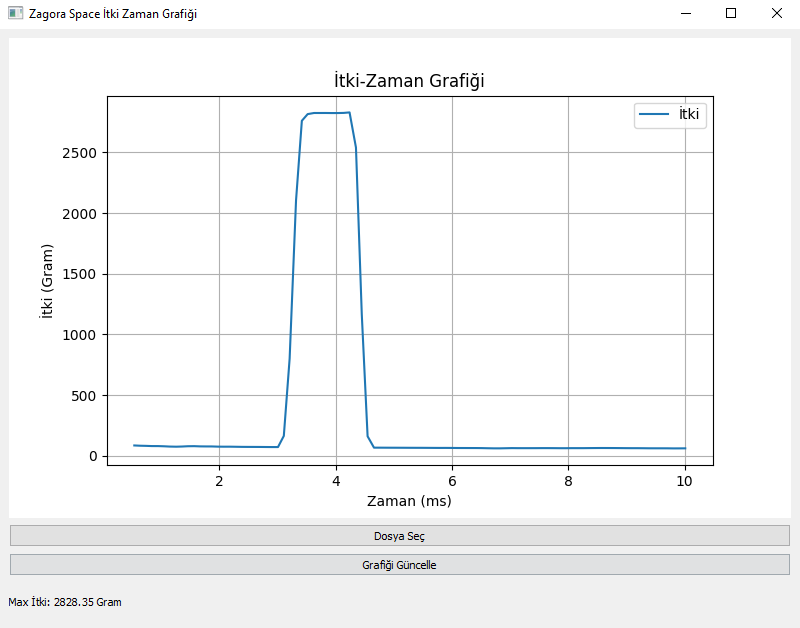
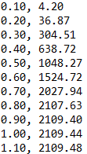

# Thrust Measurement Graph

This project visualizes **thrust-time** data collected from a rocket or propulsion system. It provides a **GUI-based** solution for loading and plotting thrust data using **PyQt5** and **Matplotlib**.

## 🚀 Features
- 📂 **File Selection** – Load thrust data from a `.txt` file.
- 📊 **Real-Time Plotting** – Visualize thrust vs. time dynamically.
- 🎛 **Interactive GUI** – Built with PyQt5 for an intuitive experience.
- 📉 **Data Processing** – Handles time and thrust values for accurate plotting.

## 🖥️ Preview
  

## 📊 How Should The Text File Look Like ?

Time in milliseconds on the left, time in grams on the right. Note the commas and periods.
